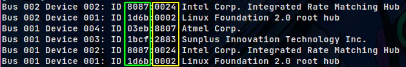

# Android not Recognized on Linux

Already faced with the fact of connect a android device and it not be recognized on a Linux system when it's executed
the command `adb devices`?

For this have some steps that can be a possible solution for this problem:

1. Activate the USB debugging option on android device, for this it's necessary to have the developer mode activated
2. Inside the directory `/etc/udev/rules.d` create the file `51-android.rules` with the following content:

```
SUBSYSTEM="usb", ATTRS{idVendor}=="< vendor's id >", MODE="0666", OWNER="< username >", GROUP="< username >"
```

**obs:** To knows the vendor's id and the product's id execute the command `lsusb`



The green side it's the vendor's id and the yellow side it's the product's id, to pass the product's id add:

```
ATTRS{idProduct}=="< product's id >"
```

After write the file it's necessary update the devices rules and restart the service

```
sudo udevadm control --reload-rules
sudo systemctl restart udev.service
```

If no one of this solution works have the [JMTPFS](https://github.com/JasonFerrara/jmtpfs) utility, with it's possible
to execute the command `mount` on android partition

by @thebe111
